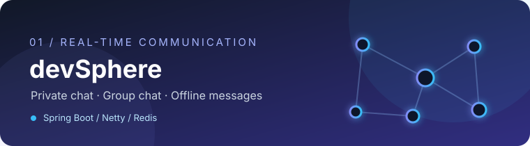
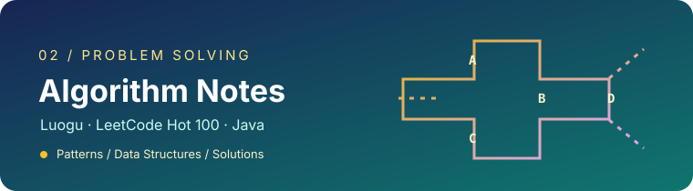

  

  <picture>
    <source media="(prefers-color-scheme: dark)" srcset="https://readme-typing-svg.demolab.com?font=JetBrains+Mono&weight=500&size=18&pause=1600&color=58A6FF&center=true&vCenter=true&width=780&height=44&lines=Java+Backend+%C2%B7+Real-time+Communication+%C2%B7+Microservices;Spring+Boot+%C2%B7+Netty+%C2%B7+Redis+%C2%B7+WebSocket;Vue+3+%C2%B7+TypeScript+%C2%B7+Electron;Always+building%2C+always+learning" />
    
  </picture>

  <b>把实时通信、微服务和 AI 应用，做成可靠的产品。</b>

  <a href="#-关于我">关于我</a> &nbsp;·&nbsp;
  <a href="#-精选项目">精选项目</a> &nbsp;·&nbsp;
  <a href="#-技术栈">技术栈</a> &nbsp;·&nbsp;
  <a href="https://github.com/shutu-hub/shutu-hub/issues">交流 ↗</a>

 

### ✦ 关于我

目前在 [shenlan-ai](https://github.com/shenlan-ai) 做 **AI + HR 微服务系统**，覆盖微前端桌面端与 Go 后端服务。我主要关注 Java 后端架构、实时通信、分布式系统，以及 LLM 在真实业务里的工程化落地。

业余时间整理 [洛谷 / LeetCode Hot 100 题解](https://github.com/shutu-hub/Luogu-and-LeetCode-algorithm-solutions)，喜欢把复杂问题拆成可验证的小步骤。

### ✦ 精选项目

<table>
  <tr>
    <td width="50%" valign="top">
      
      <h3><a href="https://github.com/shutu-hub/devSphere">devSphere ↗</a></h3>
      
<b>高性能实时聊天系统</b> · 私聊、群聊、消息持久化与离线消息，探索可扩展的即时通讯架构。

      
<code>Java</code> <code>Spring Boot</code> <code>Netty</code> <code>WebSocket</code> <code>Redis</code>

      01 / REAL-TIME COMMUNICATION
    </td>
    <td width="50%" valign="top">
      
      <h3><a href="https://github.com/shutu-hub/Luogu-and-LeetCode-algorithm-solutions">算法题解 ↗</a></h3>
      
<b>洛谷 / LeetCode Hot 100</b> · 按题号索引题解，持续整理算法与数据结构的解题思路。

      
<code>Java</code> <code>Algorithms</code> <code>Data Structures</code>

      02 / PROBLEM SOLVING
    </td>
  </tr>
</table>

### ✦ 技术栈

<table>
  <tr>
    <td width="95"><b>后端</b></td>
    <td><code>Java</code> <code>Go</code> <code>Spring Boot</code> <code>Netty</code> <code>Redis</code> <code>PostgreSQL</code></td>
  </tr>
  <tr>
    <td><b>客户端</b></td>
    <td><code>Vue 3</code> <code>TypeScript</code> <code>Vite</code> <code>Electron</code></td>
  </tr>
  <tr>
    <td><b>工程化</b></td>
    <td><code>Docker</code> <code>Linux</code> <code>Git</code> <code>Python</code></td>
  </tr>
</table>

### ✦ 贡献记录

  <picture>
    <source media="(prefers-color-scheme: dark)" srcset="https://streak-stats.demolab.com?user=shutu-hub&hide_border=true&locale=zh&background=0D1117&border=30363D&stroke=30363D&ring=818CF8&fire=38BDF8&currStreakNum=E6EDF3&sideNums=E6EDF3&currStreakLabel=8B949E&sideLabels=8B949E&dates=6E7681" />
    
  </picture>

喜欢这些项目？欢迎去仓库看看，或在 <a href="https://github.com/shutu-hub/shutu-hub/issues">Issues</a> 交流。

